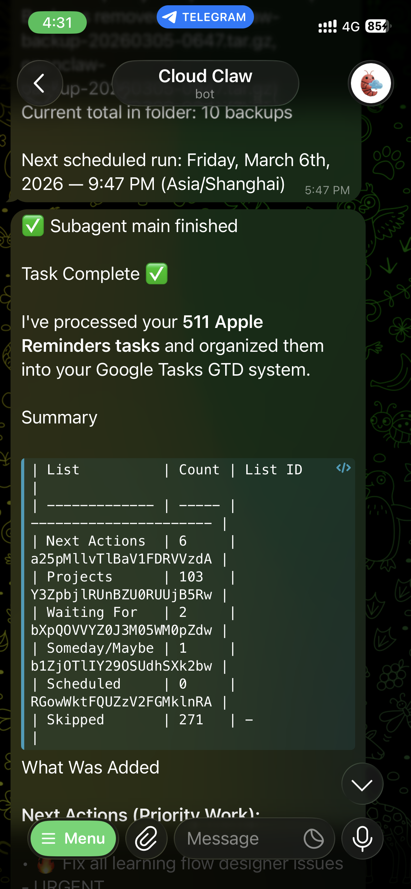

# AGENTS.md — FOSSASIA 2026 Presentation

> Guide for AI agents working in this repository

---

## Project Overview

This is a **Reveal.js HTML presentation** for FOSSASIA Summit 2026 titled "From Vibe Coding to Life Automation". It's a self-contained, static HTML presentation with no build step required.

- **Live URL:** https://aungmyokyaw.github.io/fossasia-2026-presentation/
- **Duration:** 15 minutes | **Slides:** 17
- **Framework:** Reveal.js 5.1.0 (loaded via CDN)

---

## Project Structure

```
.
├── index.html                 # Main presentation (single file, all slides)
├── README.md                  # Public documentation
├── AGENTS.md                  # This file
├── docs/
│   ├── INDEX.md              # Quick nav to speaker materials
│   ├── README_FOR_SPEAKER.md # Delivery strategy guide
│   ├── SPEAKER_SCRIPT.md     # Full word-for-word script (~15 min)
│   └── SPEAKER_CHEATSHEET.md # One-page emergency reference
├── screenshot/               # Demo screenshots for slides
│   ├── 01-telegram-gtd-migration.png
│   ├── 02-telegram-calendar-scheduling.png
│   ├── 03-telegram-backup-automation.png
│   ├── 04-system-gws-demo-01.png
│   ├── 05-system-gws-demo-02.png
│   ├── 06-system-gws-demo-03.png
│   ├── 07-system-gws-demo-04.png
│   ├── claude-code.png
│   ├── demo-discover.png
│   ├── kimi-cli.png
│   ├── opencode.png
│   └── pi.png
├── plugin/                   # Reveal.js plugins (local copies)
│   ├── zoom/                 # Zoom plugin
│   ├── notes/                # Speaker notes plugin
│   ├── search/               # Search plugin
│   ├── math/                 # Math rendering (KaTeX/MathJax)
│   ├── markdown/             # Markdown plugin
│   └── highlight/            # Code highlighting
└── tests/
    └── validation.js         # Browser-based validation tests
```

---

## Essential Commands

### View the Presentation

```bash
# macOS
open index.html

# Linux
xdg-open index.html

# Or serve with local server (for full features)
python3 -m http.server 8000
# Then visit http://localhost:8000
```

### Run Validation Tests

Open browser console on the presentation and run:
```javascript
PresentationTests.runAll()
```

Tests validate:
- Lucide icons loaded and rendered
- No emojis remaining (if using icons)
- Fact-check corrections applied

---

## Code Organization

### Single-File Architecture

The entire presentation lives in `index.html`:

1. **Head section** (lines 1-669): CSS styles, fonts, Reveal.js theme
2. **Body section** (lines 671-1329): All 17 slides as HTML sections
3. **Script section** (lines 1331-1349): Reveal.js initialization

### Slide Structure

Each slide is a `<section>` element:

```html
<section>
  <div class="slide-label orange">Act I — The Problem</div>
  <h2>Slide Title</h2>
  <div class="divider"></div>
  <!-- Content here -->
</section>
```

### CSS Architecture

Custom CSS uses CSS variables for theming (GitHub-inspired dark palette):

```css
:root {
  --bg:        #0d1117;
  --surface:   #161b22;
  --surface2:  #21262d;
  --border:    #30363d;
  --accent:    #7aa2f7;
  --accent2:   #bb9af7;
  --green:     #9ece6a;
  --orange:    #ff9e64;
  --red:       #f7768e;
  --cyan:      #7dcfff;
  --text:      #e6edf3;
  --text2:     #8b949e;
  --text3:     #484f58;
  --mono:      'JetBrains Mono', monospace;
  --sans:      'Outfit', system-ui, sans-serif;
}
```

---

## Key Patterns & Conventions

### Slide Labels

Use `.slide-label` with color variants for section markers:

```html
<div class="slide-label">Default (blue)</div>
<div class="slide-label green">Act II — Vibe Coding</div>
<div class="slide-label orange">Act I — The Problem</div>
<div class="slide-label purple">Architecture</div>
<div class="slide-label red">Warning/Error</div>
<div class="slide-label cyan">Leadership</div>
```

### Layout Patterns

**Two-column layout:**
```html
<div class="two-col">
  <div><!-- Left content --></div>
  <div><!-- Right content --></div>
</div>
```

**Card grid:**
```html
<div class="cards col2">  <!-- or col3 -->
  <div class="card">
    <div class="card-label">Label</div>
    <h3>Title</h3>
    <p>Description</p>
  </div>
</div>
```

**Stats block:**
```html
<div class="stats">
  <div class="stat">
    <div class="stat-num">511</div>
    <div class="stat-label">Tasks migrated</div>
  </div>
</div>
```

**Step list:**
```html
<div class="steps">
  <div class="step">
    <div class="step-num">1</div>
    <div class="step-body">
      <h4>Title</h4>
      <p>Description</p>
    </div>
  </div>
</div>
```

**Code block with syntax highlighting:**
```html
<div class="code-block">
<span class="c-dim"># Comment</span>
<span class="c-cyan">$</span> <span class="c-green">command</span>
<span class="c-accent">highlight</span>
</div>
```

### Typography Classes

- `.mono` — JetBrains Mono font
- `.text-accent`, `.text-green`, `.text-orange`, `.text-red`, `.text-cyan`, `.text-purple` — Color utilities
- `.text-muted`, `.text-dim` — Secondary text
- `.small` — Smaller text size

---

## Testing Approach

### Browser Console Tests

The `tests/validation.js` file provides browser-based tests:

```javascript
// Load in browser console, then:
PresentationTests.runAll()
```

### Manual Testing Checklist

Before committing changes:
- [ ] Open `index.html` in browser
- [ ] Navigate through all 17 slides
- [ ] Verify screenshots load correctly
- [ ] Check responsive layout at different sizes
- [ ] Test keyboard navigation (arrow keys, space)
- [ ] Verify print/PDF export works (add `?print-pdf` to URL)

---

## Important Gotchas

### No Build Step

This is a **static HTML file** — no npm, no bundler, no build process. Changes to `index.html` are immediately visible when refreshed.

### CDN Dependencies

Reveal.js and fonts load from CDNs:
- `cdnjs.cloudflare.com` — Reveal.js CSS/JS
- `fonts.googleapis.com` — Google Fonts (Outfit, JetBrains Mono)

**Offline presentation:** Download CDN assets locally if presenting without internet.

### Image Paths

Screenshots are referenced with relative paths:
```html

```

Always verify images exist in `screenshot/` folder.

### Reveal.js Configuration

Configuration at bottom of `index.html`:

```javascript
Reveal.initialize({
  hash: true,              // URL hash for direct slide links
  slideNumber: 'c/t',      // "current/total" format
  progress: true,          // Progress bar at bottom
  controls: true,          // Navigation arrows
  center: false,           // Don't vertically center (custom CSS handles this)
  transition: 'none',      // No animations (clean, fast)
  width: 1280,             // Base width
  height: 720,             // Base height
});
```

### Slide Numbering

HTML comments mark slide numbers:
```html
<!-- SLIDE 01: TITLE ──────────────────────────────────── -->
<!-- SLIDE 02: THE PROBLEM ─────────────────────────────── -->
```

Keep these comments updated when adding/removing slides.

---

## Speaker Materials

When editing content, also check these files may need updates:

| File | Purpose |
|------|---------|
| `docs/SPEAKER_SCRIPT.md` | Word-for-word script — update if slide content changes significantly |
| `docs/SPEAKER_CHEATSHEET.md` | One-pager — update key facts/numbers |
| `docs/README_FOR_SPEAKER.md` | Strategy guide — update timing if slide count changes |

---

## Content Guidelines

### Tone

- **Honest, not salesy** — "There is no silver bullet"
- **Story-driven** — Problem → Journey → Proof → Solution
- **Action-oriented** — End with clear takeaways

### Key Themes

1. AI conquered coding, now it can conquer life management
2. Vibe coding = staying in flow, minimizing context switching
3. Terminal-first, CLI-driven automation
4. Self-hosted, local data, full control

### Critical Lines (Don't Change Without Review)

- "If AI can run my code, why can't it run my life?"
- "We've automated everything except ourselves"
- "AI has conquered coding. Now conquer life."

---

## Deployment

Hosted on **GitHub Pages** from `master` branch:

1. Push changes to `master`
2. GitHub Pages auto-deploys
3. Live at: https://aungmyokyaw.github.io/fossasia-2026-presentation/

---

## License

MIT © Aung Myo Kyaw
